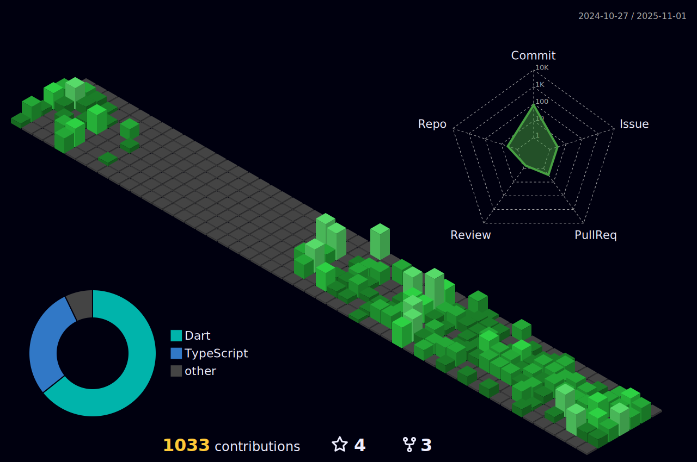

### Hello I'm Daniel Augusto

- 🔭 Trabalho como Mobile Developer na Dopster.io.
- 🌱 Estou atualmente aprendendo testes em Flutter e Kotlin
- 😄 Tenho conhecimento amplo em React | Next | Dart/Flutter

 

<!-- Tecnologis que domino -->

## <b> Tech Stack</b>
 

 

## <b> GitHub Stats</b>
 
<!--  -->
 

<!-- Endereços para contato -->

## <b>Let's Connect!</b>
 

 

  

